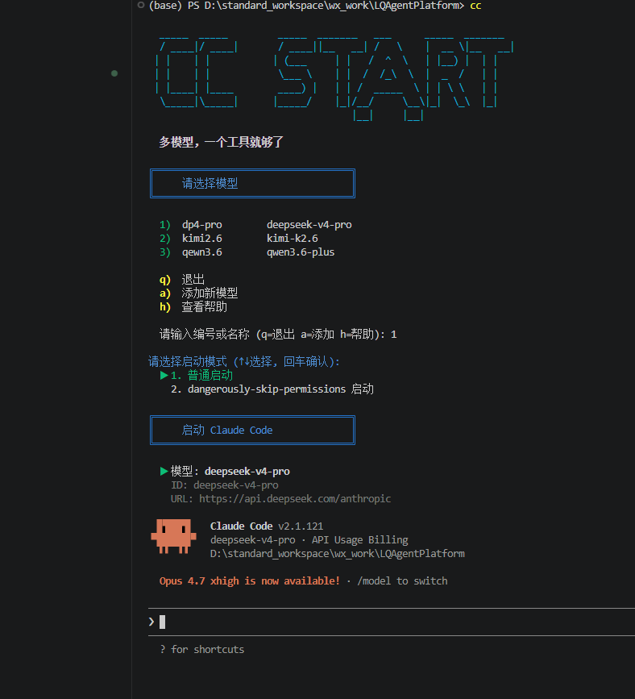

# CC Start

```
  _____  _____         _____  _______   ___      _____  _______ 
  / ____|/ ____|       / ____||__   __| /   \    |  __ \|__   __|
 | |    | |           | (___     | |   /  ^  \   | |__) |  | |   
 | |    | |            \___ \    | |  /  /_\  \  |  _  /   | |   
 | |____| |____        ____) |   | | /  _____  \ | | \ \   | |   
  \_____|\_____|      |_____/    |_|/__/     \__\|_|  \_\  |_|   
                                    |__|     |__|                
```

**一条命令，终结 Claude Code 的上手门槛。多模型，一个工具就够了。**

---

## 为什么选择 CC Start？

Claude Code 默认只认 Anthropic 自家模型——想用国产大模型？环境变量、配置文件、每个窗口各自为战，稍不留神全面冲突。

CC Start 让你彻底告别这些折腾：

| | |
|---|---|
| 🚀 **一条命令装好一切** | 自动检测 & 安装 Node.js、Claude Code，脚本直达 PATH，安装即用，零手动 |
| 🎯 **多模型无缝切换** | `cc kimi` → `cc qwen` → `cc glm` — 一条命令换模型，比切歌还流畅 |
| 🪟 **多窗口独立运行** | 每个终端独立配置互不干扰，4 个窗口跑 4 个模型，随心所欲 |
| ➕ **任意模型随心加** | `cc add` 三步上手，兼容任何 Claude API 服务，不挑品牌不限数量 |
| 🌍 **全平台统一体验** | Windows / macOS / Linux 通吃，CMD、PowerShell、Bash 全支持 |

## 一分钟安装

```bash
git clone https://github.com/wandanan/cc_start.git && cd cc_start

# Windows → 双击运行
install.bat

# Mac / Linux → 终端执行
chmod +x install.sh && ./install.sh
```

安装脚本自动完成：

```
✅ 检测 & 自动安装 Node.js / Claude Code（缺失时）
✅ 复制启动脚本到系统 PATH
✅ 创建配置目录，预置模型配置模板
✅ 自动注册 cc 和 ccs 两个命令
✅ Windows 自动配置 PATH，无需手动操作
```

> **macOS 用户注意**：系统自带 bash 版本为 3.2，不支持关联数组。请先通过 Homebrew 安装新版 bash：
> ```bash
> brew install bash
> ```
> Linux 用户无需此步骤，系统自带 bash 4.0+ 已满足要求。

> **安装后提示命令找不到？** Windows 安装程序会自动添加 PATH，但如果失效请手动添加：
> `系统属性 → 环境变量 → 编辑用户 PATH → 新建 → %USERPROFILE%\.local\bin`

## 快速开始

安装完成后，先添加模型配置，然后就能用了：

```bash
# 添加模型配置
cc add

# 交互式选择模型启动
cc

# 或直接指定模型
cc kimi
cc qwen
```

```bash
$ cc

╔════════════════════════════════════╗
║     Claude Code 模型选择器         ║
╚════════════════════════════════════╝

  1) kimi        - Kimi K2.5
  2) qwen        - 千问 3.5 Plus
  3) glm         - GLM 5
  4) mini        - MiniMax M2.5

请选择模型 (输入编号或名称): 2

请选择启动模式 (↑↓选择, 回车确认):

  ▶ 1. 普通启动
    2. dangerously-skip-permissions 启动

🚀 启动 Claude Code [千问 3.5 Plus]...
```

## 命令详解

| 命令 | 说明 |
|---|---|
| `cc` | 交互式选择模型启动（↑↓ 方向键 + 回车确认） |
| `cc <模型名>` | 跳过菜单，直接启动指定模型 |
| `cc add` | 添加新模型配置（三步走：名称 → Key → URL） |
| `cc edit [模型名]` | 编辑已有模型配置 |
| `cc remove [模型名]` | 删除模型配置 |
| `cc ls` | 列出所有已配置模型 |
| `cc sync [模型名]` | 同步当前 MCP/插件配置到指定模型 |
| `cc reset` | 清空所有模型配置 |
| `cc -h` | 查看帮助 |

> 💡 `cc` 和 `ccs` 完全等价。Linux 系统默认有 `/usr/bin/cc`（C 编译器），若需区分使用 `ccs` 即可。

## 支持的模型

预置 4 个国产大模型配置模板，填入 API Key 即刻启动：

| | 命令 | 模型 | 提供商 |
|---|---|---|---|
| 🔵 | `cc kimi` | Kimi K2.5 | Moonshot |
| 🟢 | `cc qwen` | 千问 3.5 Plus | Alibaba |
| 🟣 | `cc glm` | GLM 5 | Zhipu |
| 🟠 | `cc mini` | MiniMax M2.5 | MiniMax |
| ⚪ | `cc <自定义>` | 任意模型 | 任意兼容 Claude API 的服务 |

```bash
# 打开 4 个终端，各跑各的

终端 1 > cc kimi     # Kimi K2.5
终端 2 > cc qwen     # 千问 3.5 Plus
终端 3 > cc glm      # GLM 5
终端 4 > cc mini     # MiniMax M2.5
```

> 🔒 每个窗口独立配置，互不干扰，互不打架。

## 添加你自己的模型

`cc add` 支持添加任意兼容 Claude API 的模型，只需提供：

- **启动命令名称**（如 `deepseek`，之后用 `cc deepseek` 启动）
- **模型 ID**（如 `deepseek-v3`）
- **API Key**
- **Base URL**（API 端点地址）

```bash
cc add
# 按提示依次输入上述信息即可
```

配置文件保存在 `~/.claude/models/` 目录下，格式如下：

```json
{
  "env": {
    "ANTHROPIC_AUTH_TOKEN": "your-api-key",
    "ANTHROPIC_BASE_URL": "https://api.example.com/anthropic",
    "ANTHROPIC_MODEL": "model-name"
  }
}
```

## 工作原理

CC Start 通过 Claude Code 的 `--settings` 参数为每个实例指定独立的配置文件：

```bash
claude --settings ~/.claude/models/kimi.json
claude --settings ~/.claude/models/qwen.json
```

每个窗口使用独立配置，多窗口同时运行互不干扰。不同于旧式的替换 `settings.json` 方案，无需复制或覆盖全局配置。

## 依赖

- [Claude Code](https://claude.ai/code) — 安装脚本会自动检测并在缺失时通过 npm 安装
- Git Bash (Windows) 或 Bash 4.0+ (Mac/Linux)
  - macOS：系统自带 bash 3.2，需 `brew install bash`
  - Linux：主流发行版自带 bash 4.x/5.x，无需额外安装

## License

MIT

---

<p align="center">
  <b>如果这个项目对你有帮助，点个 ⭐ Star 就是最大的鼓励！</b>
</p>

[](https://star-history.com/#wandanan/cc_start&Date)
